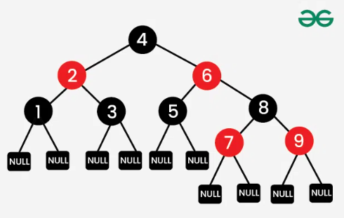

# this file is just for drafting purposes 

## Red-Black Properties

1. Every node is either red or black.
2. The root is black.
3. There are no two adjacent red nodes.
4. Every path from a node (including root) to any of its descendants NULL nodes has the same number of black nodes.
5. All leaves (NULL nodes) are black.

## Resources
https://github.com/zarif98sjs/RedBlackTree-An-Intuitive-Approach
https://pages.cs.wisc.edu/~jinc/
https://www.geeksforgeeks.org/introduction-to-red-black-tree/
https://chatgpt.com/share/68303b5b-9cbc-800b-a43e-3c7e9d5b9c9e
https://www.happycoders.eu/algorithms/red-black-tree-java/